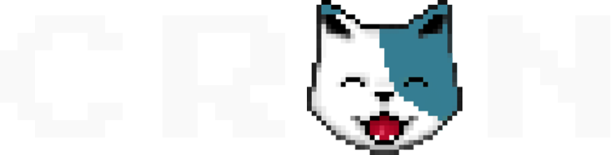

# Cron.cat Brand

Logos, colors, fonts & metadata.
All assets apply attached [license](./LICENSE).

## Directory:

* [Colors](./colors/)
* [Fonts](./fonts)
* [Logos](./logos)
* [Mascots](./mascots)
* [Metadata](./metadata)

----

## Logos

**[Croncat Logo Dark](./logos/croncat_logo_dark.png)**

 

**[Croncat Logo Light](./logos/croncat_logo_light.png)**

 

**[Croncat Bug](./logos/croncat_bug.png)**

 

----

## Mascots

We live in the multi-chain universe, where there are many different mascots supporting each chains brand/identity.

**[Osmosis Croncat](./mascots/OsmoCat-head.png)**

